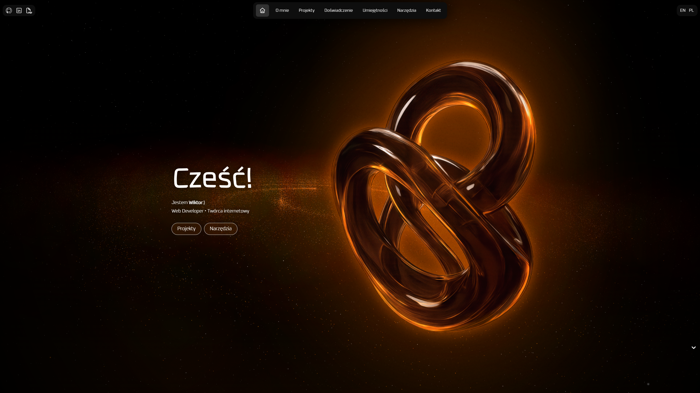

⚠️ Portfolio w trakcie budowy!

# Strona Portfolio

Witaj w repozytorium mojej osobistej strony portfolio! To miejsce, gdzie prezentuję swoje umiejętności, projekty i doświadczenia związane z programowaniem, tworzeniem stron internetowych i rozwijaniem kreatywnych rozwiązań.

###### Strona główna. Rozdzielczość ekranu: 2560x1440

## Opis projektu

Strona portfolio to narzędzie pozwalające zaprezentować moje umiejętności i dotychczasowe prace. Została zaprojektowana z myślą o nowoczesnym designie, funkcjonalności i łatwej nawigacji. 

Link do portfolio: [wiktorgolab.github.io](https://wiktorgolab.github.io)

## Kontakt

Jeśli masz pytania lub chciałbyś nawiązać współpracę, zapraszam do kontaktu poprzez formularz dostępny na stronie portfolio lub bezpośrednio przez e-mail. 

